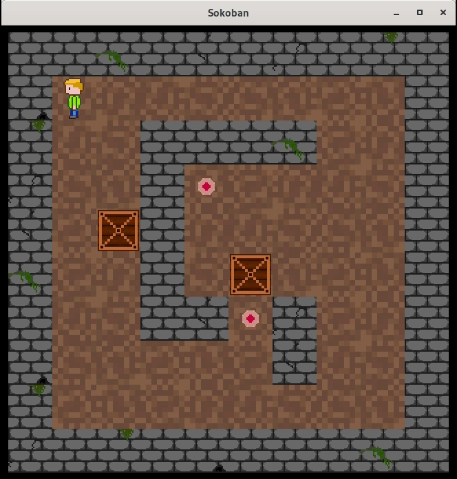

# Sokoban

Basic pure C99 minimal-dependency single-binary implementation of the
[Sokoban](https://en.wikipedia.org/wiki/Sokoban) game.  
All assets get encoded in base64 and compiled into the binary.



## Requirements

Application has the following dependencies:

* `SDL2`
* `SDL2-image`
* `clang`

## Building

Build with make:

```
make
```

run single executable with default level:

```
build/sokoban
```

or select other level:

```
build/sokoban -f levels/level4.sok
```
